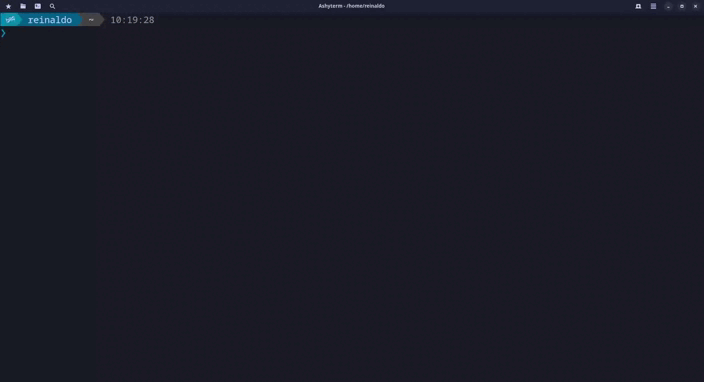

# 🚀 BigUpdate

<p align="center">
  
  
  
</p>

<p align="center">
  
</p>

**BigUpdate** is a Bash automation script developed for **BigLinux Plasma** systems using **BTRFS + Timeshift**.

It automates the entire system maintenance workflow:
- official package updates
- AUR package updates
- Flatpak updates
- orphan cleanup
- snapshot verification
- execution logging

---

## 💡 Why does this project exist?

I have always enjoyed performing updates directly through the terminal, especially within the Arch/Manjaro/BigLinux ecosystem. However, before updating the system, I ended up manually repeating practically the same ritual every time:

- checking for updates
- reviewing Timeshift snapshots
- searching for orphan packages and removing them
- updating official repositories
- updating AUR packages
- updating Flatpaks
- cleaning unused dependencies

After doing this repeatedly for a long time, I decided to automate the entire process into a single command.

The real reason?

Laziness.

So I kept improving this script until it became mature enough to share.

---

## ✨ Main Features

### 🔒 Strict Security (`Strict Mode`)

Uses:

```bash
set -euo pipefail
```

to immediately stop execution if any intermediate command fails, preventing partial updates or inconsistent states.

---

### 📝 Log Redirection

Automatically creates a simple execution log for the script at:

```bash
~/bigupdate.log
```

Recording:

- list of pending updates
- updated packages
- execution timestamps
- complete system output

For future reference in case the script fails or closes unexpectedly.

---

### 📸 Timeshift + BTRFS Integration

Since the default BigLinux setup uses the BTRFS filesystem and Timeshift for daily snapshots, I took advantage of this in the script to automatically verify snapshots from the current day before updating and offer automatic creation of a preventive snapshot.

This allows BigLinux users to revert all modifications by selecting the previous snapshot in the boot menu.

---

### 🧹 Orphan Package Management

Detects and offers safe removal of orphan dependencies using:

```bash
pacman -Qtdq
```

Over time, I encountered several issues with orphan packages lacking maintenance or support that eventually interfered with system updates.

Since these packages are **normally** no longer necessary, I started removing them before updates to reduce the chances of conflicts, broken dependencies, or failures during the upgrade process.

For this reason, the script performs the check before updating the system and offers the option to clean the orphan packages found.

Personally, after updates, I prefer not to remove orphans immediately (which could also be done after the update), since some software may still depend on them indirectly (a very remote possibility in my view, depending on your system usage). Since temporarily keeping these packages installed usually does not cause problems, they remain in the system until the next script execution, which will remove them before attempting another update.

---

### 🔄 Complete Ecosystem Update

Updates:

- pacman
- yay/AUR
- Flatpak

---

### 🧼 Flatpak Auto Cleanup

Removes unused Flatpak runtimes and dependencies after the update.

---

### 🔔 Desktop Notifications

Sends notifications via `notify-send` when updates are installed, recommending a system reboot.

---

## 🛠️ Requirements

The script includes automatic dependency verification.

Make sure you have:

- `yay`
- `flatpak`
- `timeshift`
- `libnotify`

Recommended installation (not required on BigLinux Plasma):

```bash
sudo pacman -S flatpak timeshift libnotify
```

---

## 📦 Installation

### 1. Clone the repository and enter the project directory

```bash
git clone https://github.com/ReinaldoDiasAbreu/big-update.git
cd big-update
```

---

### 2. Installation

```bash
makepkg -si
```

---

### 3. Run

After the installation is complete, you can start the project from anywhere in the terminal by running:

```bash
big-update
```

> [!NOTE]
> After the installation is complete, you can safely delete the cloned folder (`big-update`). However, **it is recommended to keep it**. This way, when new updates are available, you only need to enter the same folder, run `git pull` to download the latest changes, and execute `makepkg -si` again to update.

---

## 🔧 Optionally Updating Mirrors

The script includes optional support for automatically updating the mirror list using:

```bash
./big-update --upmirrors
```

This option runs:

```bash
sudo pacman-mirrors -f
```

before synchronizing the repositories.

Although useful in some situations, updating mirrors on every execution is usually unnecessary and increases the update process time. In most cases, the configured mirrors continue working correctly for long periods. For this reason, I left this feature optional in the script, allowing mirror updates only when necessary.

Examples of error messages where updating mirrors is a solution because the system starts using more up-to-date and stable servers:

```text
error: failed retrieving file
error: database is not valid
error: failed to synchronize all databases
error: target not found
error: signature is invalid
error: corrupted database
```

This happens because mirrors are distributed replicas of the official repositories and do not always remain perfectly synchronized with each other. Depending on the state of the selected mirror, situations such as the following may occur:

- the database has already been updated, but the package has not yet been replicated
- a mirror is temporarily offline
- the server has high latency
- files were partially synchronized
- a mirror became outdated compared to the others
- a cache/CDN failure occurred during download

---

## 📄 Log

The complete execution log is saved at:

```bash
~/bigupdate.log
```

The file is automatically recreated on each execution to avoid excessive growth. It only stores the script output along with some additional information about the updated packages and their versions.

---

## 📜 License

MIT License
